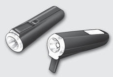
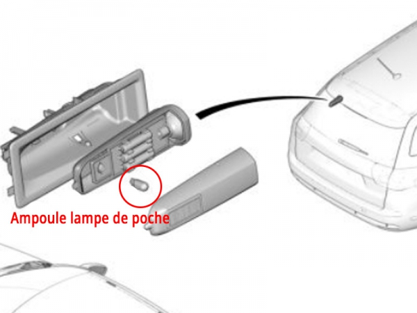
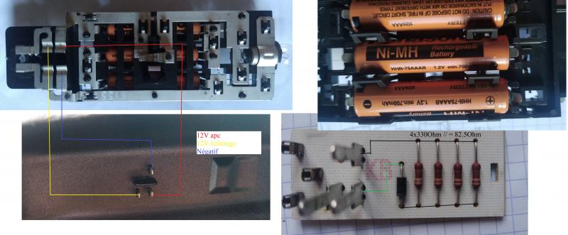

# Projet de Modernisation de la Lampe Nomade Citroën

## Contexte et Objectif
Modernisation de la lampe nomade (réf. 6362Z0) du coffre des Citroën C5 Tourer. Cette lampe d'origine combine :
- Un éclairage fixe du coffre
- Une fonction lampe de poche amovible

Le projet vise à conserver le boîtier d'origine tout en modernisant l'électronique pour améliorer les performances et ajouter des fonctionnalités connectées.

## Fonctionnalités

### Fonctionnalités actuelles

La lampe actuelle utilise une ampoule W5W halogène avec une lentille comme sur les autres porte-lampes de la voiture.
L'ampoule en mode lampe de poche est une BA9S 4V, vraiment très faible.
La lampe ne contient aucun circuit électronique, juste quelques pistes pour apporter le courant de charge aux accumulateurs NiMH et le courant pour alimenter la lampe de coffre quand le hayon s'ouvre.
Les accumulateurs sont chargés grâce à un circuit simpliste, une diode et trois résistances.

### Fonctionnalités d'origine améliorées
- Éclairage de coffre LED (déjà implémenté avec W5W LED)
- Fonction lampe de poche avec LED haute luminosité
- Charge de la batterie lorsque le contact est mis
- Autonomie minimale de 45 minutes en mode portable

### Nouvelles fonctionnalités
- Transmission de la position GPS via LoRa
- Détection de mouvement et d'orientation
- Détection du retrait/replacement dans le support
- Possibilité de détection d'accident (forte décélération)
- Monitoring de l'état de la batterie

## Modules Matériels

### Alimentation
- Batterie : Li-ion 18650 (remplace les accus NiMh)
- Chargeur : Module TP4056 avec protection
- Convertisseur DC-DC pour adaptation des tensions

### Contrôle
- Microcontrôleur basse consommation (STM32L0 ou SAMD21)
- Accéléromètre MEMS (MPU6050 ou LIS3DH)
- Bouton poussoir pour contrôle de la lampe portable

### Communication
- Module LoRa RFM95W
- Module GPS

### Éclairage
- LED haute luminosité pour fonction portable (3-5W)
- LED W5W pour éclairage coffre

## Modes de Fonctionnement

### Mode "Voiture en Mouvement"
- Détection : 12V après contact + mouvement
- Transmission GPS toutes les 1-2 minutes
- Charge continue de la batterie
- Modules actifs en permanence

### Mode "Voiture Statique avec Contact"
- Détection : 12V après contact sans mouvement
- Transmission GPS toutes les 15-30 minutes
- Charge continue
- Modules en mode économie entre les transmissions

### Mode "Batterie Seule"
- Transmission uniquement sur événements
- Modules en sommeil profond
- Préservation de la batterie pour fonction lampe

## Connexions

### Entrées
- +12V après contact : Alimentation principale et détection contact
- +12V coffre ouvert : Détection ouverture et éclairage coffre
- Bouton poussoir : Contrôle lampe portable
- Accéléromètre : Détection mouvement/orientation
- GPS : Position

### Sorties
- LED coffre
- LED portable
- Transmission LoRa

### Communications I2C
- Accéléromètre ↔ MCU

### Communications SPI
- LoRa ↔ MCU
- GPS ↔ MCU

## Séquences de Détection

### Retrait de la Lampe
1. Détection +12V coffre (hayon ouvert)
2. Détection mouvement
3. Perte du +12V coffre
- → Envoi notification LoRa avec état batterie et dernière position

### Replacement de la Lampe
1. Détection mouvement
2. Retour du +12V coffre
- → Envoi notification LoRa de replacement

## Schéma de Câblage

[Voir schéma système précédent pour les connexions principales]

Points critiques de câblage à considérer :
- Protection contre l'inversion de polarité sur les entrées 12V
- Découplage approprié pour les pics de consommation LoRa
- Isolation des circuits de puissance (LED) et de signal
- Routage optimal des antennes LoRa et GPS
- Plan de masse cohérent
- Protection ESD sur toutes les entrées/sorties accessibles

## Prochaines Étapes Suggérées
1. Prototype du circuit d'alimentation et charge
2. Test des LEDs et contrôle luminosité
3. Intégration MCU et capteurs basiques
4. Ajout modules de communication
5. Tests d'intégration
6. Conception PCB final
